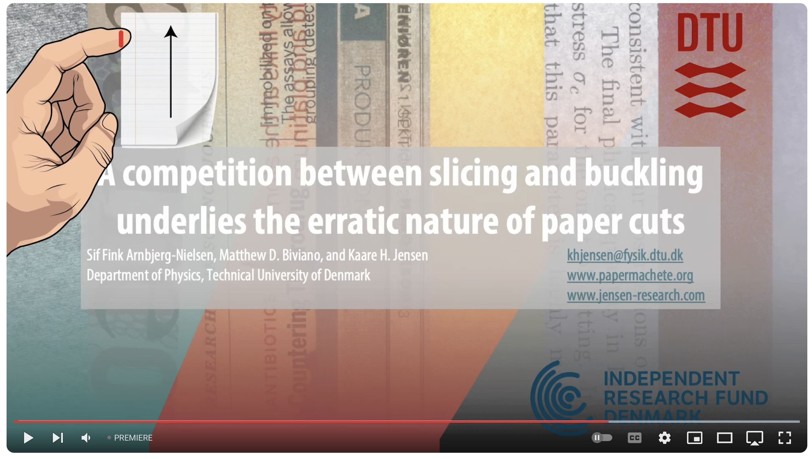
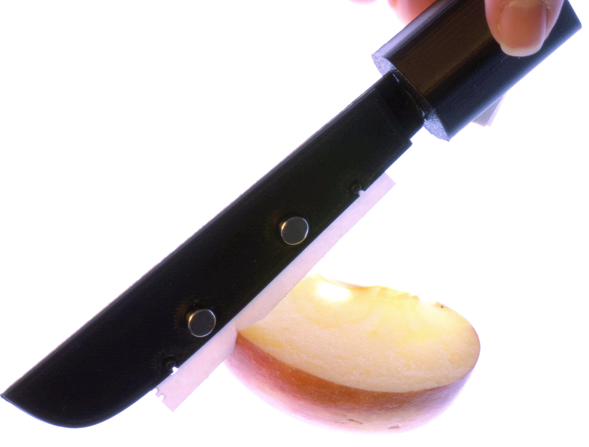

# THE PAPER CUT PARADOX: Explaining why thin paper does not cut
Paper cuts are a common injury that can cause significant pain and discomfort [1]. Surprisingly, the physics underpinning a thin flexible sheet of paper slicing into soft tissues remains unresolved. (Other cases, such as chess-wire cutters, have been described; e.g., [2].) In particular, the unpredictable occurrence of paper cuts, often restricted to a limited thickness range, has not been explained. Here, we visualized and quantified the motion, deformation, and stresses during paper cuts, uncovering a remarkably complex relationship between cutting, geometry, and material properties [3]. A model based on the hypothesis that competition between slicing and buckling controls the probability of initiating a paper cut was developed and successfully validated. 

Our experiments revealed that competition between slicing and buckling underlies the erratic nature of paper cuts. Thin paper can’t cut because it lacks the structural integrity to resist buckling. Thick paper, in contrast, distributes the load across a large area and is also unable to cut. This explains why only paper within a narrow thickness range can cut. The most hazardous paper thickens is 65 μm, corresponding, e.g., to dot matrix paper or printed scientific journals (including Nature and Science). 

Finally, we developed the _Papermachete_, a cost-effective paper-based scalpel based on our results. It uses scrap paper blades and can easily cut into vegetables and meat. To 3D print your own, use the files accessible [here](https://github.com/Jensen-Lab/PhysicsOfPaperCuts/tree/main/3DPrint).

## Press coverage
[September 7th 2024: Science Alert](https://www.sciencealert.com/scientists-reveal-the-absolute-worst-thickness-for-a-paper-cut)

[September 7th 2024: Donga Science](https://www.dongascience.com/news.php?idx=67344)

[September 6th 2024: Weekendavisen](https://www.weekendavisen.dk/ideer/det-farligste-papir)

[September 4th 2024: Radio SRF 1, Kultur aktuell](https://www.srf.ch/wissen/mensch/verflixte-schnittverletzungen-warum-papier-schneidet)

[September 1st 2024: Physics World](https://physicsworld.com/a/researchers-cut-to-the-chase-on-the-physics-of-paper-cuts/)

[August 29th 2024: GEO Magazine](https://www.geo.de/wissen/forschung-und-technik/kuriose-wissenschaft--welches-papier-birgt-das-groesste-schnitt-risiko--35019300.html)

[August 28th 2024: Der Spiegel](https://www.spiegel.de/wissenschaft/mensch/mit-welchem-papier-man-sich-am-ehesten-in-den-finger-schneidet-a-06ee99cb-c833-47ff-806f-d06854aad74e)

[August 28th 2024: Nature Briefings (Podcast)](https://www.nature.com/articles/d41586-024-02806-7)

[August 28th 2024: NPR](https://www.npr.org/2024/08/28/nx-s1-5090010/the-physics-behind-a-very-annoying-thing-that-could-ever-happen-to-you-a-paper-cut)

[August 28th 2024: Le Monde](https://www.lemonde.fr/article-offert/zognioeqtptu-6297641/comment-eviter-peut-etre-de-se-couper-les-doigts-en-feuilletant-un-journal)

[August 27th 2024: Phys.org](https://phys.org/news/2024-08-paper-likelihood.html)

[August 27th 2024: Popular Science](https://www.popsci.com/science/paper-cut-study/)

[August 26th 2024: Daily Mail](https://www.dailymail.co.uk/sciencetech/article-13739439/Scientists-reveal-paper-painful-cuts.html)

[August 23rd 2024: France Info](https://www.francetvinfo.fr/replay-radio/le-billet-vert/des-chercheurs-danois-se-sont-penches-sur-la-dangerosite-des-papiers-qui-coupent_6665652.html)

[August 23rd 2024: Nature, Research Highlights](https://www.nature.com/articles/d41586-024-02297-6)

[August 16th 2024: Ingeniøren](https://ing.dk/artikel/vaerd-vide-pas-paa-ingenioeren-kan-let-lave-snitsaar-i-din-finger)

[August 12th 2024: ABC Melbourne, Drive](https://www.abc.net.au/listen/programs/melbourne-drive/drive/104188682)

[August 6th 2024: The Morning Show](https://www.facebook.com/watch/?v=430936466599208)

[August 3rd 2024: New York Post](https://nypost.com/2024/08/03/lifestyle/scientists-have-uncovered-the-physics-behind-paper-cuts/)

[August 2nd 2024: This Is Going Well, I Think with David Cooper](https://podcasts.apple.com/dk/podcast/croquet-or-crochet-august-2-2024/id1168275879?i=1000664191260)

[July 31st 2024: Science News](https://www.sciencenews.org/article/paper-cut-physics)

[July 22nd 2024: Economy Chosun](https://economychosun.com/site/data/html_dir/2024/07/19/2024071900032.html)

[July 19th 2024: Huffington Post, Korea](https://www.huffingtonpost.kr/news/articleView.html?idxno=225660)

[July 13th 2024: Health Chosun](https://health.chosun.com/site/data/html_dir/2024/07/11/2024071101712.html)

[July 9th 2024: Hankyoreh Newsletter](https://www.hani.co.kr/arti/science/science_general/1148276.html)

[July 1st 2024: Herald Economy](https://news.heraldcorp.com/view.php?ud=20240701050718)

[July 1st 2024: Chosun Biz](https://biz.chosun.com/science-chosun/science/2024/07/01/T6GORBARANAIPL2TONKUM775KE/?utm_source=naver&utm_medium=original&utm_campaign=)

[July 1st 2024: Metro.co.uk](https://metro.co.uk/2024/07/01/worst-paper-paper-cuts-revealed-can-even-slice-chicken-21139872/)

[Jun 28th 2024: New Scientist](https://www.newscientist.com/article/2437150-physicists-determined-the-paper-most-likely-to-give-you-a-paper-cut/)

[Jun 28th 2024: CBC Radio, As It Happens](https://www.cbc.ca/listen/live-radio/1-2-as-it-happens/clip/16078411-point-counterpoint-return)

## Publication
[Manuscript](https://github.com/Jensen-Lab/PhysicsOfPaperCuts/blob/main/Arnbjerg-NielsenPapercut2024.pdf)
[Journal website](http://journals.aps.org/pre/accepted/aa072Kc5A071ae0708c39799a466b7d26e3ac2a0e). 

## Errata
Table I (Caption): "MPa" -> "GPa" (27 Aug 2024)

## Contact
Kaare H. Jensen, Department of Physics, Technical University of Denmark
Email: khjensen@fysik.dtu.dk 
Phone: +45 2231 5241

## Press kit
Please access the preprint, images, and videos [here](PressKit).

## References
- [1] Mirsky, S., The unkindest cut, Scientific American 306, 80, 2012
- [2] Reyssat, E., Tallinen, T., Le Merrer, M., & Mahadevan, L. Slicing softly with shear. Physical review letters, 109(24), 244301, 2012
- [3] Arnbjerg-Nielsen S. F., Biviano M. D., & Jensen, K. H., Competition between slicing and buckling underlies the erratic nature of paper cuts, Physical Review E (2024) [accepted preprint](PressKit/manuscript.pdf) [journal](http://journals.aps.org/pre/accepted/aa072Kc5A071ae0708c39799a466b7d26e3ac2a0e). 

 

## Acknowledgements
We are grateful to Norwid Behrnd and Keunhwan Park for providing additional examples of press coverage.
