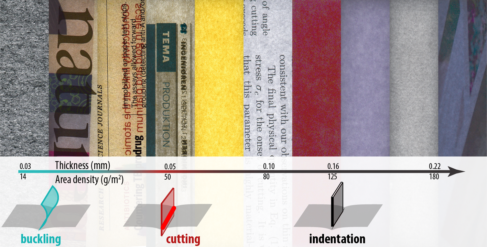

# THE PAPER CUT PARADOX: Explaining why thin paper does not cut
Paper cuts are a common injury that can cause significant pain and discomfort [1]. Surprisingly, the physics underpinning a thin flexible sheet of paper slicing into soft tissues remains unresolved. (Other cases, such as chess-wire cutters, have been described; e.g., [2].) In particular, the unpredictable occurrence of paper cuts, often restricted to a limited thickness range, has not been explained. Here, we visualized and quantified the motion, deformation, and stresses during paper cuts, uncovering a remarkably complex relationship between cutting, geometry, and material properties [3]. A model based on the hypothesis that competition between slicing and buckling controls the probability of initiating a paper cut was developed and successfully validated. 

This explains why paper with a specific thickness is most hazardous (≈65 μm, corresponding, e.g., to dot matrix paper or printed scientific journals). We developed the _Papermachete_, a cost-effective paper-based scalpel based on our results. It uses scrap paper blades and can easily cut into vegetables and meat. To 3D print your own, use the files accessible [here](https://github.com/Jensen-Lab/PhysicsOfPaperCuts/tree/main/paper%20machete).

Email for correspondence: khjensen@fysik.dtu.dk 

## References
- [1] Mirsky, S., The unkindest cut, Scientific American 306, 80, 2012
- [2] Reyssat, E., Tallinen, T., Le Merrer, M., & Mahadevan, L. Slicing softly with shear. Physical review letters, 109(24), 244301, 2012
- [3] Arnbjerg-Nielsen S. F., Biviano M. D., & Jensen, K. H., Competition between slicing and buckling underlies the erratic nature of paper cuts, Physical Review E (2024) [WWW](https://journals.aps.org/pre/accepted/aa072Kc5A071ae0708c39799a466b7d26e3ac2a0e)
